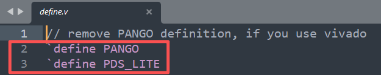
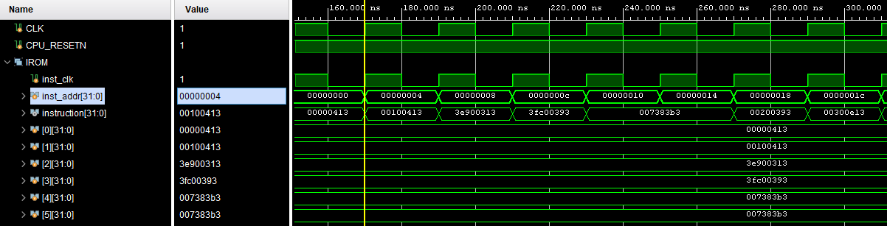
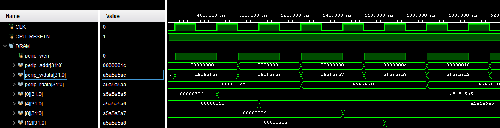
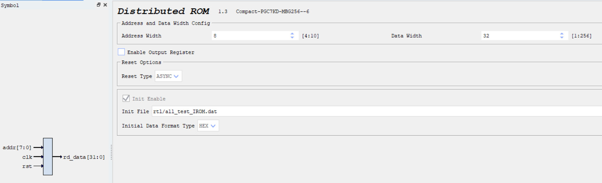
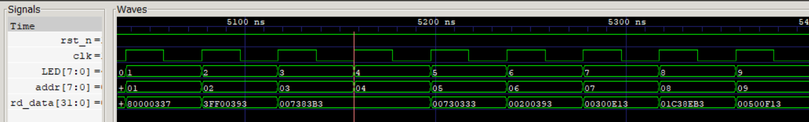
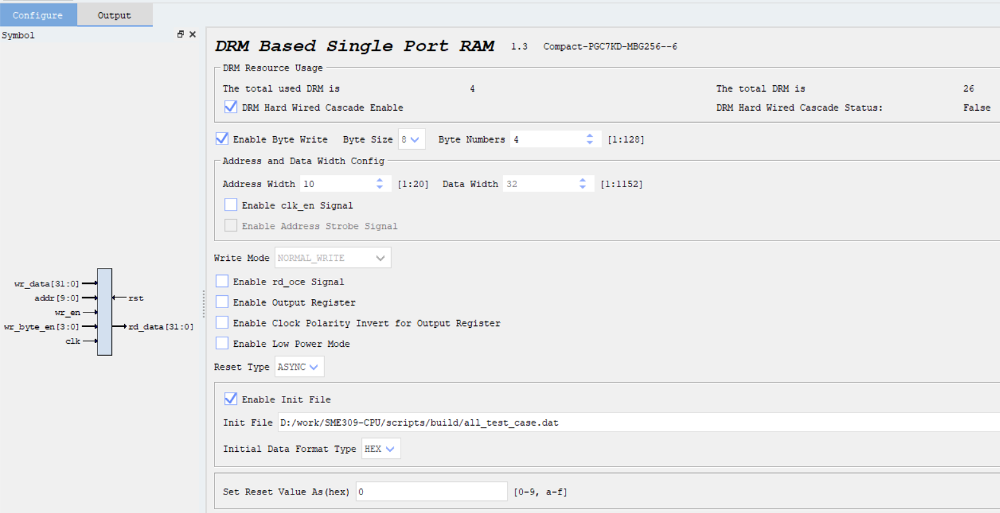
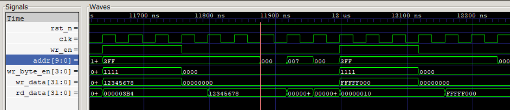

# SME309-CPU 项目总览与使用指南

SME309-CPU 是一个基于 FPGA 的 RISC-V RV32I 处理器工程，包含完整的软硬件环境：指令与数据存储器（IROM/DRAM），测试程序与内存初始化工具脚本，以及可在 Vivado 和 PDS 上综合、实现与下载的硬件工程。

## 构建与内存初始化
在 `scripts` 目录已提供批处理脚本与转换工具，支持将 `.s` 汇编程序构建为用于 IP 内存初始化的 `.coe` 与 `.dat` 文件。
```
scripts/
├── src/                    # 源文件目录
│   ├── add_loop.s         # 加法循环测试程序
├── tools/                  # 工具脚本目录
│   ├── all_test_case.py   # 测试用例数据生成器
│   ├── bin2coe.py         # 二进制转COE格式工具
│   └── bin2dat.py         # 二进制转DAT格式工具
├── build/                  # 构建输出目录（自动生成）
│   ├── *.o                # 目标文件
│   ├── *.bin              # 二进制文件
│   ├── *.txt              # 反汇编文件
│   ├── *.coe              # COE格式文件（用于Vivado）
│   └── *.dat              # DAT格式文件 (用于PDS和仿真)
├── add_loop_build.bat     # 加法循环程序构建脚本
└── README.md              # 本说明文件
```

- 构建加法循环测试程序：
```powershell
cd scripts
.\add_loop_build.bat 
```
或
```powershell
.\add_loop_build_embed.bat
```
- 后续可自行修改测试程序 `scripts\src\add_loop.s`

构建完成后，输出位于 `scripts\build\`：
- `*.bin`：二进制镜像
- `*.txt`：反汇编（便于校验与调试）
- `*.coe`：Vivado COE 格式（用于 Block RAM/IROM 初始化）
- `*.dat`：PDS DAT 格式（用于 Block RAM/IROM 初始化, 和仿真初始化）

## Vivado 使用细节

### 修改 `rtl/define.v` 



如上图, 针对 vivado 的使用, 删除第2、3行。

### IROM 参数与使用说明
IROM使用的是Read Only `Distributed Memory` 。
- IP参数：
  - `DATA_WIDTH = 32`：每个地址存储 32 位指令。
  - `ADDR_WIDTH`：根据指令容量设定（例如 10~12 位）。
  - `INIT_FILE`：指向 `*.coe` 文件（脚本在 `scripts/build` 生成）。
  - `INIT_FORMAT = HEX`：通常使用十六进制初始化。
- 地址约定：
  - 项目当前统一“字地址”访问，软件端数组寻址采用 `base + 4*i`、相邻元素 `+4`。
- 访问特性与时序（同步 ROM）：
  - 需要读取的数据会在当前周期返回。
- 初始化步骤：
  - 在 IROM IP 的 `Memory Initialization` 属性中选择生成的 `*.coe`。
  - 重新综合后，Bitstream 会包含初始化内容。 
  下图为`IROM`读时序，可以看出向`IROM`发送地址后，指令会立刻返回。
  


### DRAM 参数与使用说明
- IP 参数：
  - `ADDR_WIDTH = 10`：深度 1024 字。
  - `DATA_WIDTH = 32`：每地址 32 位数据。
  - `INIT_FILE = all_test_case.dat`：数据初始化文件（可选）。
  - `INIT_FORMAT = HEX`：十六进制格式。
- 地址约定：
  - 项目当前统一“字地址”访问，软件端数组寻址采用 `base + 4*i`、相邻元素 `+4`。
- 基本读写时序（同步 RAM）：
  - 写：
    - 在时钟上升沿，`wr_en=1` 时将 `wr_data` 写入 `addr` 指定位置。
    - 写入立即生效，通常同周期不可读出新值（依 IP 行为而定）。
  - 读：
    - 给定 `addr` 且 `wr_en=0`，在下一个时钟周期 `rd_data` 有效。

下图为`DRAM`读写时序。可以看出`DRAM`的寻址方式与`IROM`不同，它每一个地址都存放了一个32为的数据。向`DRAM`写入的数据会在下一个时钟周期存进指定地址。读操作也类似，给定地址后，在下一个时钟周期`rd_data`有效。



## PDS 使用细节

### 修改 `rtl/define.v` 


如上图, 针对 PDS-lite版本, 保留第2、3行。针对 PDS 2022正式版，保留第2行，删除第3行。

### IROM 参数与使用说明
IROM使用的是Read Only `Distributed Memory` 。
- IP参数：
  - `DATA_WIDTH = 32`：每个地址存储 32 位指令。
  - `ADDR_WIDTH`：根据指令容量设定（例如 8 位）。
  - `INIT_FILE`：指向 `*.dat` 文件（脚本在 `scripts/build` 生成）。
  - `INIT_FORMAT = HEX`：通常使用十六进制初始化。



- 地址约定：
  - 项目当前统一“字地址”访问，软件端数组寻址采用 `base + 4*i`、相邻元素 `+4`。
- 访问特性与时序（同步 ROM）：
  - 需要读取的数据会在当前周期返回。
- 初始化步骤：
  - 在 IROM IP 的 `Memory Initialization` 属性中选择生成的 `*.dat`。
  - 重新综合后，Bitstream 会包含初始化内容。 
  下图为`IROM`读时序，可以看出向`IROM`发送地址后，指令会立刻返回。
  


### DRAM 参数与使用说明
- IP 参数：
  - `ADDR_WIDTH = 10`：深度 1024 字。
  - `DATA_WIDTH = 32`：每地址 32 位数据。
  - `INIT_FILE = all_test_case.dat`：数据初始化文件（可选）。
  - `INIT_FORMAT = HEX`：十六进制格式。



- 地址约定：
  - 项目当前统一“字地址”访问，软件端数组寻址采用 `base + 4*i`、相邻元素 `+4`。
- 基本读写时序（同步 RAM）：
  - 写：
    - 在时钟上升沿，`wr_en=1` 时将 `wr_data` 写入 `addr` 指定位置。
    - 写入立即生效，通常同周期不可读出新值（依 IP 行为而定）。
  - 读：
    - 给定 `addr` 且 `wr_en=0`，在下一个时钟周期 `rd_data` 有效。
    - 通过 4-bits 的 `wr_byte_en` 输入，控制读出指定字节。

下图为`DRAM`读写时序。可以看出`DRAM`的寻址方式与`IROM`不同，它每一个地址都存放了一个32为的数据。向`DRAM`写入的数据会在下一个时钟周期存进指定地址。读操作也类似，给定地址后，在下一个时钟周期`rd_data`读出数据。



## 上板效果
- 程序烧入后，CPU自动运行（如果配置了CPU_RUN信号，则需按下按键才能运行）。所有拨码开关全部拨到`0`，数码管显示的是运行测试程序的总时间，单位位`us` (用于性能对比)。
- 将`SW0`拨到`1`，数码管显示当前通过的指令数 (用于上板结果检查)。
- 将`SW1`拨到`1`，数码管显示，测试程序结果1 (用于上板结果检查)。
- 将`SW2`拨到`1`，数码管显示，测试程序结果2 (用于上板结果检查)。
- 将`SW3`拨到`1`，程序返回的结果，为`1`则表示测试通过；存在错误显示`-1`(即 `FFFFFFFF`)。
- Xilinx开发板按下按键`BTNL`（紫光开发板将`SW7`拨打`1`）,数码管显示当前`pc`值。
